# HiDolly - SMS and Speech to Text to Image Generation

## First Round Mini Exploratorium


## Intro

The idea for this [Balena Labs](https://github.com/balenalabs) residency is to have a mini Exploratorium art generator that is voice activated when someone walks up and motion's detected.

This project was part of an onboarding residency for my new job at [Balena](https://balena.io). [Phil](https://github.com/phil-d-wilson) easily convinced me to do something fun with art, goofing around, researching, and learning new stuff. I hadn't played with all the AI art generators so I wanted to learn more about them. DALLE2 exploded when I was in the middle of my residency and the art generators have gotten really great.
The datasets for image generation have been gathered from all around the web, generally already tagged with text description during day to day human internet usage like the images on wikipedia. When you enter a text prompt for what image you want, OpenAI has what's called CLIP which ranks the images as to how likely they are actually what the text prompt is. It goes through many iterations until it generates the best image.


Thanks [nucleardreamer](https://github.com/nucleardreamer) for being my guide through the residency! 

### What you will need:
- [Raspberry Pi](https://www.aliexpress.com/item/4000130040254.html?key=a7e37b5f6ff1de9cb410158b1013e54a&prodOvrd=RAC&opt=false&aff_fcid=4d2d920f11ef4078804fb898b3aa854b-1638805157605-08626-_9xk30H&tt=CPS_NORMAL&aff_fsk=_9xk30H&aff_platform=shareComponent-detail&sk=_9xk30H&aff_trace_key=4d2d920f11ef4078804fb898b3aa854b-1638805157605-08626-_9xk30H&terminal_id=5408ef9d287140f483e79c70c12dadf0)
- [PIR motion sensor](https://learn.adafruit.com/pir-passive-infrared-proximity-motion-sensor/)
- LED for Motion Sensor (optional but nice to have)
- Raspberry Pi display
- [USB Battery](https://www.amazon.com/gp/product/B0744HYN4M/ref=ppx_yo_dt_b_search_asin_title?ie=UTF8&th=1)
- USB - C cable for battery to Raspberry Pi4
- [Twilio Account and phone number](https://www.twilio.com/try-twilio)
- NVIDIA GPU or Google Colab or some place to host DALLE
- Phone
- [Mini Exploratorium Box with roof and plexiglass door like a little library](https://www.etsy.com/listing/801828498/little-free-library-unfinished-mini?ga_order=most_relevant&ga_search_type=all&ga_view_type=gallery&ga_search_query=mini+library&ref=sr_gallery-1-3&frs=1&bes=1&sts=1&organic_search_click=1)
- post mount
- 4x4 post
- Sand or concrete for post

## Setup and configuration

Setup the following environment variables:

### Twilio
```
fromPhone
organizationSid
accountSid
apiKey
apiSecret
TwiMLAppSID
project_name
statusCallback
outgoingMessageSMS
outgoingMessageSMS: 'Hi Dolly! We are generating your image: ',
```

### General
```
host # This is your balena public url
gibberishString # gibberish string on endpoints, maybe it gets hacked less
imageFolder: './public/assets/images/ai/',
```

### Database
``` 
databaseName: './data/dbpi.db',
collectionName: 'hidolly',
tableName: 'hidolly',
```


## Software

- [Web Speech Api](https://wicg.github.io/speech-api/)
- [Google Web Speech demo](https://www.google.com/chrome/demos/speech.html)
- [Google colab](https://colab.research.google.com/notebooks/welcome.ipynb)
- [OpenAI](https://openai.com/blog/dall-e/)

## Assembly

check the assets folder for the pinout diagram


Schematic:


## Development

To deploy manually or debug the application, you'll need to have [balena cli](https://www.balena.io/docs/reference/balena-cli/) installed.

```bash
git clone https://github.com/zoobot/twilio-block.git
cd twilio-block
balena push <your_device_id>.local
```

Use livepush while you are figuring out how it works. sms/twilio will need an public ip.

```
balena push localip
```

You can also run locally to test FE sending to colab and saving to db, it will fake the motion sensor
``` 
yarn install
nodemon server/index.js localhost
```

Setup the DALLE-mini playground for a fast pickup starter backend

- [DALLE-mini colab backend](https://colab.research.google.com/drive/1JXL17AycxEkLHQz0vUzfScidVURfeyhD)
- [dalle-playground](https://github.com/zoobot/dalle-playground)


## Gotchas

### Config files! 

For Balena, there's configs and environment variables. What's the difference?
Its good to read up on balena configs because it's not entirely straightforward.

Basically the balena.yml is a config file that will replace configs and envs when you deploy from hub. It does not work on cli at this time so you'd need to either put the configs in your docker-compose environment or for this specific project, create the config.js.
```
touch server/config.js
```

You can manually add, remove, change envs from the CLI but you cannot change the config.txt via CLI. You have to do it in the cloud on the device. This can definitely cause slow development for displays as you have to wait for the whole device to rebuild on change. You can edit the config.txt when sd is attached for etching.

You can also ssh into the balena os and check the config.txt at /mnt/boot. It's not editable though as it will get written over by the cloud config. I believe the order of precidence is balena.yml(if you deployed with the deploy button), then cloud config.

```
balena ssh localip
cat /mnt/boot/config.txt
```

[balena cli envs](https://www.balena.io/docs/reference/balena-cli/#envs)

[raspberry pi config.txt](https://www.raspberrypi.com/documentation/computers/config_txt.html)


### GPU/NVIDIA

Most image generation and ai in general is run on GPUs using NVidia's Cuda. Almost all open source projects are using cuda, few have a CPU fallback and if they do, it's slow. The M1 is supposed to be faster for machine learning projects but the code bases out there have not really caught up. For the Intel NUC, you can use OpenCV but it'll require a bunch of code changes for most DALLE offshoot repos. You can also connect an NVIDIA card via USB-c port to the Nuc but I haven't tried that yet. If you do, make sure you turn on UDEV in your dockerfile.template.

If you can, get an NVIDIA GPU and it will make your exploration way easier if you want to run locally or push a balena docker to a device. You will have to jump through a ton of hoops and code rewrites otherwise.

When you are doing exploration, Google Colab is super nice. You can hook up a rest server to it and just hit your endpoints there. Granted you have to have the Colab running, but still, its fast for exploratory purposes.

### PYTHON

For raspberry pi devices, expect to bang your head against python 2 and 3 library support. I spent a good amount of time mashing keyboard and staring at the dockers building to get just the right python library installed in a very specific order and combination for balena images. Just keep at it, and if its 3am, day 17 of library confusion, might be worth solving your issue in a different way. That being said, you are going to need to use Python to absorb all the awesome generative code bases, so make sure you solve your issue in a different way using Python. AI researchers use python. :)


## Thanks

Thanks for showing the way internet people!

- [Openai](https://openai.com/)
- [Laion discord](https://discord.com/invite/UxX8dv5KMh)
- [Katherine Crowson](https://github.com/crowsonkb)
- [saharmor](https://github.com/saharmor/dalle-playground) 
- [borisdayma](https://github.com/borisdayma/dalle-mini)
 
many more thanks to come

## Output

### Some Images generated with [latent-diffusion](https://github.com/CompVis/latent-diffusion)

OpenAI had said that many datasets had issues with women and racism. Like they would ask for a picture of a lawyer and it would only show white male lawyers. They wanted to guard against violence towards women or porn but when they skewed the training away from that it started erasing women altogether. I tried to play around with this some and found that when I precursed the text prompt with a culture and gender, it would do better. "Korean woman doctor in the garden" came out less skewed than "doctor in the garden". "Black woman software engineer driving" was better than "software engineer driving". It's lame there is a "default" human but I think we should understand there's cultural bias and strive for adding more descriptive input to sidestep that. Also, I found that the dataset did indeed erase women's bodies. Unless I specifically described clothes, like "woman wearing green shirt and black pants", it would only show pictures from the head up. It was very biased against feet. Pretty much never showed feet unless I specifically said boots or feet or socks, even if I said "woman's whole body wearing hat and gray dress". 
On a lighter side, it's really fun to enter wierd mythical creature mashups.
These images tend towards creepy and pretty entertaining.

## Snowy Mountain landscape puffy clouds in the sky in the style of [Elliot Green](https://www.elliottgreen.com/)

This dataset was only trained on photos wasn't able to use the Elliot Green part at all.


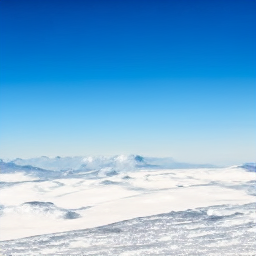


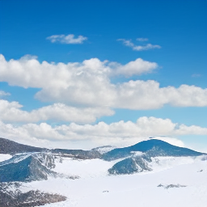

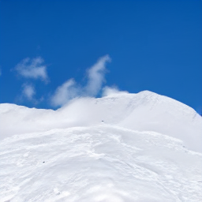
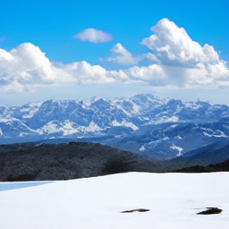


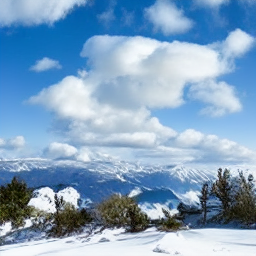


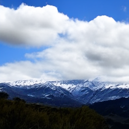
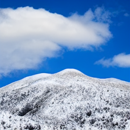

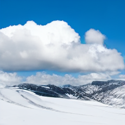


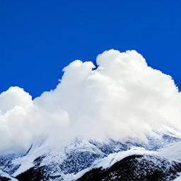


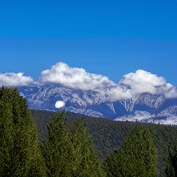


## a photo realistic woman wearing green shirt and pants on a horse

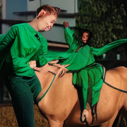


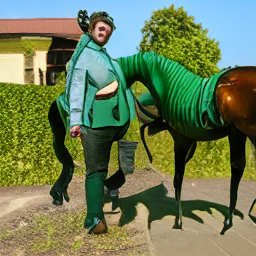
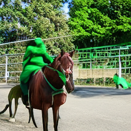

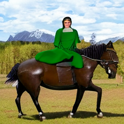


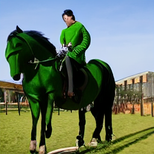
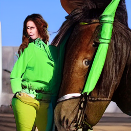

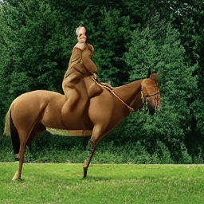


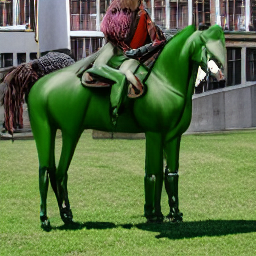
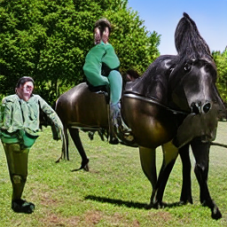

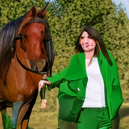

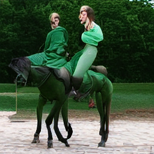


	

## a crowd eating spaghetti on dodecahedron kaleidoscope plate


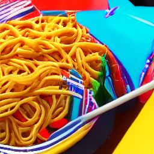
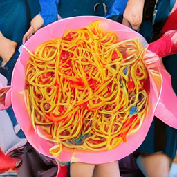


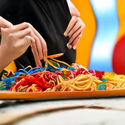
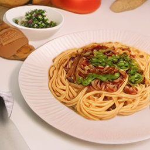
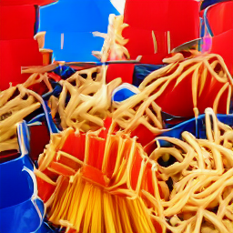

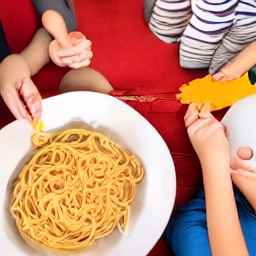
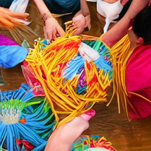


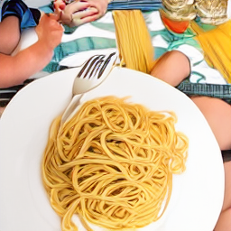
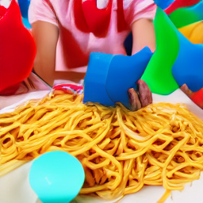

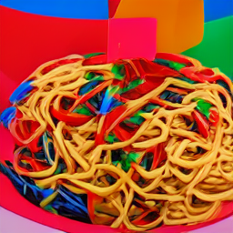


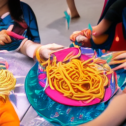

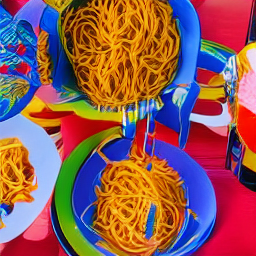
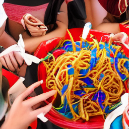


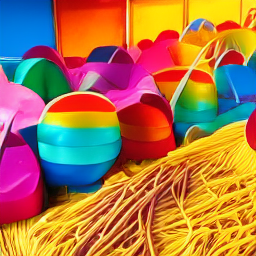
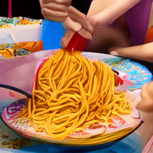


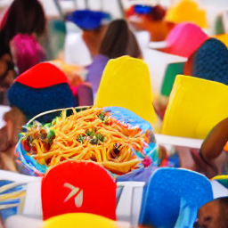
